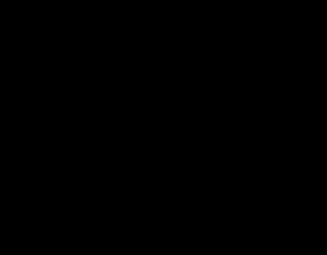

# school1 - School & Fees Management System (Java Swing + MySQL Database)

A comprehensive desktop **School & Fees Management System (`school1`)** developed in **Java Swing** using **NetBeans IDE** and **MySQL Database**. This project provides complete student lifecycle management, fee tracking, installment processing with real-time due fee calculations, and highlights relational database capabilities using **SQL Joins (`INNER JOIN`, `LEFT JOIN`)** connected via **JDBC Driver (MySQL Connector/J)**.

---

## 📌 Project Quick Info
- **NetBeans Project Name**: `school1`
- **Main Package**: `com.mycompany.school1`
- **Database Name**: `school` (or `school1`)
- **Main Class**: `com.mycompany.school1.student`

---

## 📸 Real UI Form Screenshots & Open Dropdown Gallery

Every single screenshot below is captured directly from the live Java Swing application (`school1`), showcasing filled form data, open navigation menus, and expanded student selection dropdowns:

### 1. Student Navigation Menu Open (`student.java`)
Shows the main window menu bar with the **"student"** dropdown expanded (`Add New`, `View All`, `Exit`):


### 2. Fees Navigation Menu Open (`student.java`)
Shows the main window menu bar with the **"fees"** dropdown expanded (`Total Fees`, `Show`, `Fees insaltment`):


### 3. Student Registration Form (`New_Student.java`)
Form for adding new student profiles with populated details (Name, Class, City, Address):


### 4. Total Fees Setup with Student Dropdown (`fees.java`)
Form for assigning total academic fees with the student selection **JComboBox dropdown menu expanded**:


### 5. Fee Payment & Installment Calculation (`Instalment.java`)
Form for recording student fee installments, displaying total fees, auto-calculating due fees, and featuring an **expanded student selection dropdown**:


### 6. Relational SQL Left Join View (`show.java`)
Interactive `JTable` presenting merged student profiles and fee installment records using `LEFT JOIN`:


### 7. Student Data Management Table (`tale.java`)
Full student directory with row selection, `GetData`, `Update`, and `Delete` actions:


### 8. Student Record Update Form (`up.java`)
Form pre-populated with existing student data ready for modifications:


---

## 🔌 JDBC Connectivity & MySQL Driver Setup

The application connects Java Swing GUI forms to the MySQL relational database using **Java Database Connectivity (JDBC)** and the **MySQL Connector/J Driver**.

### 1. JDBC Driver Loading & Connection String
In each form, the MySQL JDBC Driver is dynamically loaded and connected to the local MySQL server:

```java
// Load MySQL JDBC Driver
Class.forName("com.mysql.cj.jdbc.Driver");

// Establish Connection to 'school' (or 'school1') database
Connection conn = DriverManager.getConnection("jdbc:mysql://localhost:3306/school", "root", "");

// Create SQL Statement object
Statement st = conn.createStatement();
```

### 2. JDBC Operations Used
- **`st.executeQuery(sql)`**: Executes SQL `SELECT` queries and returns data in a `ResultSet` (`rs`). Used in `show.java`, `Instalment.java`, and `fees.java`.
- **`st.executeUpdate(sql)` / `st.execute(sql)`**: Executes `INSERT`, `UPDATE`, and `DELETE` statements in MySQL.

### 3. Maven Dependency (`pom.xml`)
The MySQL Connector/J driver dependency included in Maven configuration:
```xml
<dependency>
    <groupId>com.mysql</groupId>
    <artifactId>mysql-connector-j</artifactId>
    <version>8.3.0</version>
</dependency>
```

---

## 🔥 Detailed Project Features

### 1. 🎓 Student Profile Management (`student.java`, `New_Student.java`, `up.java`, `tale.java`)
- **Student Registration**: Input Student Name, Class, City, and Detailed Home Address. Automatically initializes fee tracking in the database.
- **Record Directory & Search**: View all registered students in an interactive `JTable`.
- **Update Student Info**: Select any row in the table to load existing details into an edit form and update student records.
- **Delete Student Record**: Remove student entries safely with cascading database record deletion.

### 2. 💳 Complete Fees & Installment System (`fees.java`, `Instalment.java`)
- **Total Fees Structure Assignment**: Select student from dropdown and set/update their annual total fees.
- **Installment Payment & Due Fees Calculation**:
  - Dynamically fetches student's Total Fees ($A$) and Paid Installments ($B$).
  - Auto-calculates **Due Fees** ($C = A - B$).
  - Prevents over-payment validation error popups if installment exceeds remaining due fees.

### 3. 🔗 Relational Database Architecture & SQL Joins (`show.java`, `Instalment.java`, `database.sql`)
- **Relational Tables**: `student` table (`rid` primary key) linked to `fees` table (`fid` foreign key).
- **SQL `LEFT JOIN`**: Fetches complete student lists alongside fee installment records (including students with uninitialized fee entries):
  ```sql
  SELECT * FROM student 
  LEFT JOIN fees ON student.rid = fees.fid;
  ```
- **SQL `INNER JOIN`**: Queries and updates matching student payment records during installment transactions:
  ```sql
  SELECT * FROM student 
  INNER JOIN fees ON student.rid = fees.fid 
  WHERE name = 'Rahul Sharma';
  ```

---

## 🗄️ Database Table Schema (`school` / `school1` Database)

### 1. `student` Table
| Column Name | Data Type | Constraints | Description |
| :--- | :--- | :--- | :--- |
| `rid` | INT | PRIMARY KEY, AUTO_INCREMENT | Unique Record ID |
| `name` | VARCHAR(100) | NOT NULL | Student Full Name |
| `class` | INT | NOT NULL | Student Class |
| `city` | VARCHAR(100) | DEFAULT NULL | Student City |
| `Address` | TEXT | DEFAULT NULL | Residential Address |
| `totalfees` | INT | DEFAULT 0 | Total Academic Fees |

### 2. `fees` Table
| Column Name | Data Type | Constraints | Description |
| :--- | :--- | :--- | :--- |
| `fid` | INT | PRIMARY KEY, FOREIGN KEY -> `student.rid` | Fee Record ID |
| `Feesinstalment` | INT | DEFAULT 0 | Cumulative Fees Paid |

---

## 🛠️ Technology Stack

- **Project Name**: `school1`
- **Java Swing GUI**: `JFrame`, `JTable`, `JComboBox`, `JMenuBar`, `JMenu`, `JMenuItem`, `JTextArea`, `JTextField`
- **Database Connection**: JDBC (`Connection`, `Statement`, `ResultSet`, `DriverManager`)
- **JDBC Driver**: MySQL Connector/J (`com.mysql.cj.jdbc.Driver`)
- **IDE**: NetBeans IDE
- **Database**: MySQL 8.x
- **Build Automation**: Apache Maven (`pom.xml`)

---

## 🚀 How to Run the Project

1. **Import Database**:
   - Start MySQL Server.
   - Run `database.sql` script to create `school` database and sample records:
     ```bash
     mysql -u root -p < database.sql
     ```

2. **Run in NetBeans**:
   - Open NetBeans IDE ➔ `File` ➔ `Open Project` ➔ Select `school1`.
   - Right-click `student.java` (or `com.mycompany.school1.student`) ➔ **Run File** (`Shift + F6`).

---

## 📤 Upload to GitHub Steps

Run these commands in your project folder terminal:
```bash
git init
git add .
git commit -m "Initial commit: school1 NetBeans project with SQL Joins, JDBC Driver and Swing GUI"
git branch -M main
git remote add origin https://github.com/YOUR_GITHUB_USERNAME/school1.git
git push -u origin main
```

---

## 📜 License
This project is open-source and available under the [MIT License](LICENSE).
